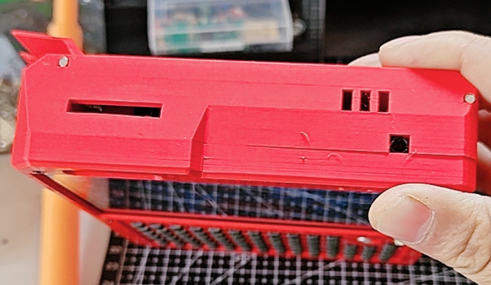
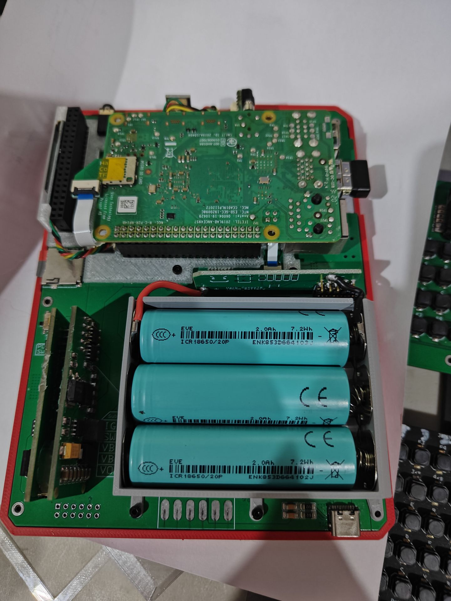

<!--
 * @Author: Entropy Disorder
 * @Date: 2025-12-17 12:30:18
 * @LastEditors: 无序熵增
 * @LastEditTime: 2025-12-18 19:02:58
 * @Description:
 *
 * Copyright (c) 2025 by Entropy Disorder, All Rights Reserved.
-->
# Hacker Console Open-Source Project

## Project Overview
**Hacker Console** is a handheld terminal designed by myself, based on the Raspberry Pi B series as the mainboard.  
If you are interested in my design, please search for **"Hacker Console"** on **Bilibili**.


As a highly expandable handheld terminal, it features:
- **Driver-free HDMI display** with touch support
- Keyboard based on the **HID protocol**, communicating via **USB**, plug-and-play
- Independent keyboard PCB design, replaceable
- Equipped with a **secondary display** for device status information
- **Exposed GPIO headers**
- **Open-source enclosure design**

## Device Views
<div align="center">
<table>
<tr>
<td align="center"><br>Right View</td>
<td align="center"><br>Left View</td>
</tr>
<tr>
<td align="center"><br>Top View</td>
<td align="center"><br>Internal Structure</td>
</tr>
</table>
</div>

## Mechanical Parts Version Selection Guide

### 📌 Version Mapping
| Your Device Version | Recommended Mechanical File | Notes |
|---------------------|-----------------------------|-------|
| **Old Version** (original keyboard + original mainboard) | `HackerConsle结构件-适用于初版键盘和初版主板.3mf` | Compatible with the earliest hardware design |
| **New Version** (improved keyboard + improved mainboard) | `HackerConsole结构件-适用于改进后的键盘以及改进后的主板.3mf` | Includes the latest design optimizations |

### 🔧 Common Hardware Components
> **Important**: Both versions use the **same common hardware components**, including:
> - Various screws
> - Hinge / shaft mechanisms
> - Standard connectors

**Be sure to refer to the bill of materials file**: 📁 `物料清单.csv`

### 🛠️ How to Choose the Correct Version
#### 1. Identify Your Hardware Version
- **Old version characteristics**: keyboard with a protruding black joystick; speaker module implemented as a separate PCB
- **New version characteristics**: small metal joystick; speaker integrated on the new mainboard with metal contacts, no wiring required

#### 2. Download the Corresponding File
```markdown
✅ **If you are using the old version:**
   Download → [HackerConsle结构件-适用于初版键盘和初版主板.3mf]

✅ **If you are using the new version:**
   Download → [HackerConsole结构件-适用于改进后的键盘以及改进后的主板.3mf]
