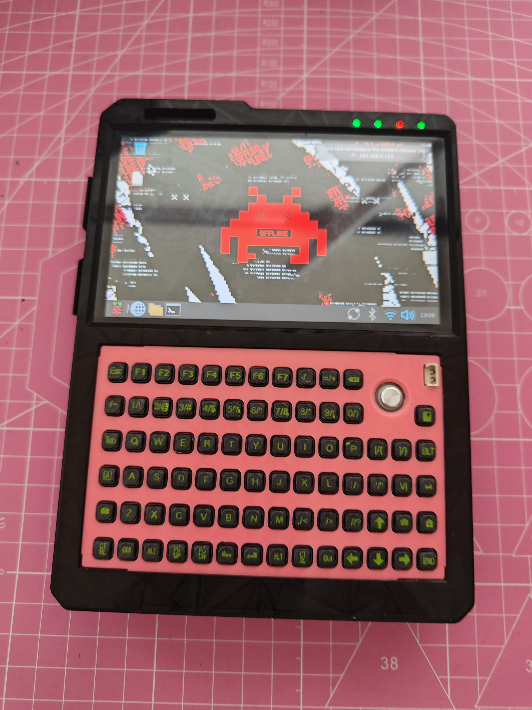
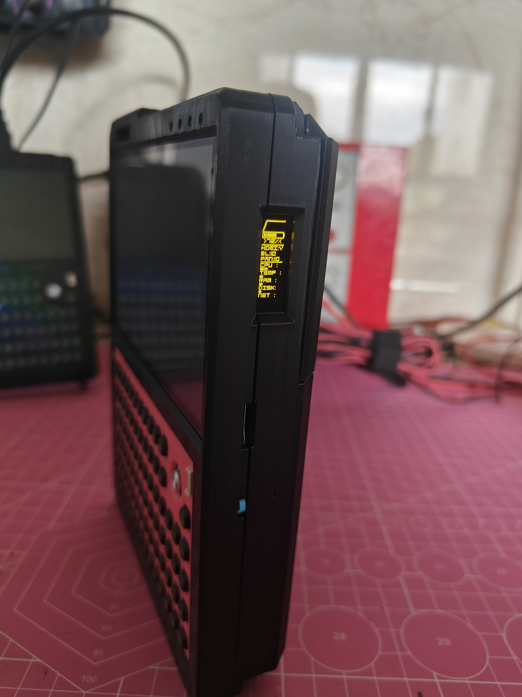
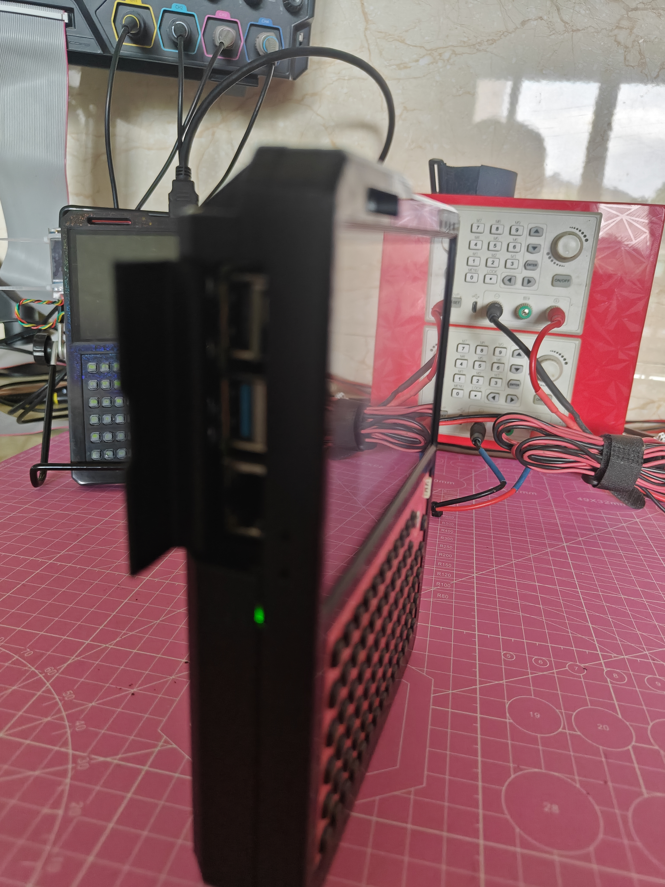
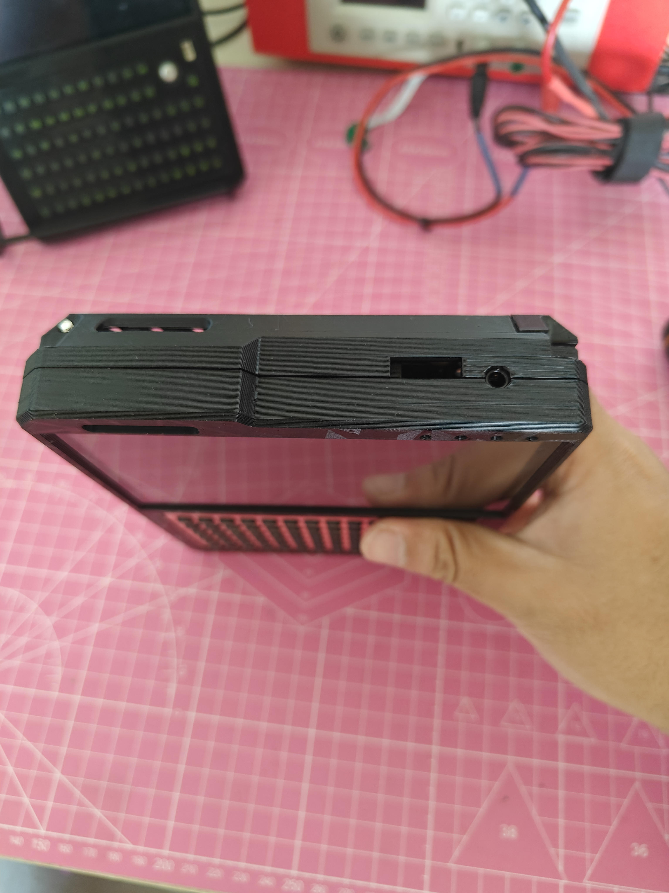
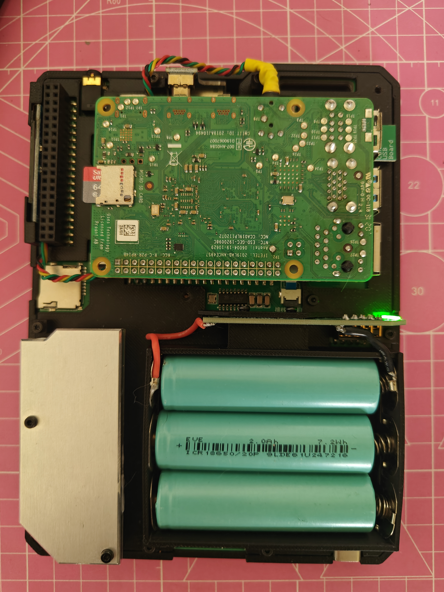

<!--
 * @Author: 无序熵增
 * @Date: 2025-12-17 12:30:18
 * @LastEditors: 无序熵增
 * @LastEditTime: 2025-12-18 19:03:49
 * @Description: 
 * 
 * Copyright (c) 2025 by 无序熵增, All Rights Reserved. 
-->
<div align="center">

🌍 **Language** / **语言选择**
  
[](readme.md)
[](readme.en.md)

</div>


# Hacker Console Open Source Project

## Update Notice
2026.6.25 - Updated the shell based on the new power module. The new shell offers higher integration and a reduced thickness of 31mm.

## Project Introduction
**Hacker Console** is a handheld terminal designed by me, powered by a Raspberry Pi B-series board.  
If you are interested in my design, please search **"Hacker Console"** on **Bilibili**.



As a highly expandable handheld terminal, it features:
- **Driverless HDMI screen** with touch support
- Keyboard uses **HID protocol** over **USB communication**, plug-and-play
- Keyboard is an independent PCB design, replaceable
- Equipped with a **secondary screen** for displaying device status
- **GPIO pins exposed**
- **Open-source shell design**

## Device Views
<div align="center">
<table>
<tr>
<td align="center"><br>Right View</td>
<td align="center"><br>Left View</td>
</tr>
<tr>
<td align="center"><br>Top View</td>
<td align="center"><br>Internal Structure</td>
</tr>
</table>
</div>

## Shell Version Selection Guide

### 📌 Version Compatibility
| Your Device Version                                    | Recommended Shell Files                                         | Description                                                                         |
| ------------------------------------------------------ | --------------------------------------------------------------- | ----------------------------------------------------------------------------------- |
| **V1 (Original keyboard + Original mainboard)**        | `HackerConsle结构件-适用于初版键盘和初版主板.3mf`               | Compatible with the earliest hardware design                                        |
| **V2 (Improved keyboard + Improved mainboard)**        | `HackerConsole结构件-适用于改进后的键盘以及改进后的主板.3mf`    | Compatible with new keyboard and new mainboard                                      |
| **V3 (Improved power board + Improved battery board)** | `hackerconsole外壳，须搭配新主板以及新键盘以及新电源板使用.3mf` | Compatible with new keyboard, new mainboard, new power board, and new battery board |

### 🔧 Common Parts
> **Important**: All versions share the **same common parts**, including:
> - All screws
> - Hinge mechanism
> - Standard connectors

**Please refer to the BOM file**: 📁 `物料清单.csv` (Bill of Materials)

### 🛠️ How to Choose the Correct Version
#### 1. Identify Your Hardware Version
- **V1 Features**: Keyboard has a protruding black joystick; speaker module is a separate PCB
- **V2 Features**: Keyboard has a small metal joystick; speaker uses metal contact components, no wiring required
- **V3 Features**: Based on V2, power board includes a heatsink, battery has a power indicator LED

#### 2. Download the Corresponding Files
```markdown
✅ **If you are a V1 user:**
   Download → [HackerConsle结构件-适用于初版键盘和初版主板.3mf]

✅ **If you are a V2 user:**
   Download → [HackerConsole结构件-适用于改进后的键盘以及改进后的主板.3mf]

✅ **If you are a V3 user:**
   Download → [hackerconsole外壳，须搭配新主板以及新键盘以及新电源板使用.3mf]
```

#### 3. Pre-Print Checklist
1. **Check Dimensions**: Preview with 3D printing software to ensure compatibility with your hardware
2. **Refer to BOM**: Prepare all required screws and accessories according to `物料清单.csv`

### ⚠️ Important Notes
- ❗ **Do not mix versions**: Old and new shell versions are **not compatible**
- 🔍 **Double-check**: Confirm the file name matches exactly before printing
- 📋 **Prepare parts**: Gather all screws and standard parts as listed in `物料清单.csv`
- 🖨️ **Print settings**: PLA material is recommended

### 💡 Need Help?
If you are unsure which hardware version you have, please join our group: 867028792

*Both versions have been thoroughly tested. Choosing the correct shell ensures the best assembly results.*

## License
[](https://opensource.org/licenses/MIT)
